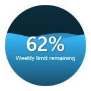
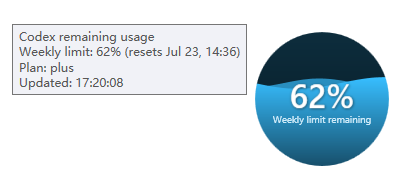
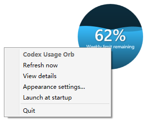
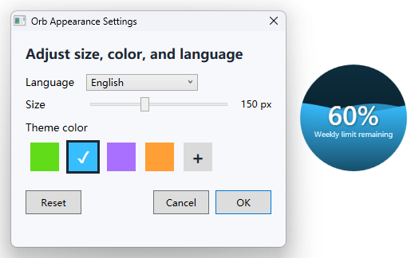

<p align="center">
  
</p>

<p align="center">
  <a href="README.md">English</a> | <strong>简体中文</strong>
</p>

# Codex 用量悬浮球

一个轻量、可拖拽的桌面悬浮球，让你随时查看 Codex 剩余用量。

> [!IMPORTANT]
> 这是一个非官方社区项目，与 OpenAI 无隶属关系，也未获得 OpenAI 官方认可。

## 功能特性

- 透明、始终置顶的桌面悬浮球
- 支持鼠标自由拖拽
- 每 5 秒刷新一次本地 Codex 用量限制数据
- 动态液面效果和剩余百分比显示
- 尺寸可在 50 至 300 px 之间动态调整
- 提供绿色、蓝色、紫色和橙色主题，并支持自定义颜色
- 默认使用英文，可在设置中切换英文或中文
- 自动保存尺寸、颜色和窗口位置
- 仅读取本地数据，不发起网络请求

## 截图

| 精简悬浮球 | 用量详情 |
| --- | --- |
|  |  |

### 右键菜单

<p align="center">
  
</p>

### 外观设置



右键菜单截图展示默认的英文界面，其他截图展示可选的中文界面。

## 平台支持

| 平台 | 状态 | 说明 |
| --- | --- | --- |
| Windows 10/11 | 已测试 | 提供源码构建脚本；建议通过 GitHub Releases 发布预编译程序。 |
| macOS 11+ | 提供源码 | 需要在 macOS 上使用 Xcode Command Line Tools 编译；当前源码尚未在 Mac 实机上验证。 |

## 工作原理

Codex 会将结构化的用量限制信息写入本地数据目录下近期的会话文件。悬浮球只读取最近更新会话文件的末尾内容，并从中提取 `rate_limits` 字段。

如果同时存在多个限制周期，主百分比会显示其中最低的剩余值。这样可以避免在每周用量仍有余额时忽略短期限制。

### 隐私说明

- 不读取 `auth.json`
- 不收集对话内容
- 不上传遥测或用量数据
- 不发起网络请求

## 快速开始

### Windows

当前本地构建输出位于 `dist/windows/CodexUsageOrb.exe`。

从源码构建：

```powershell
powershell -ExecutionPolicy Bypass -File .\scripts\build-windows.ps1
```

然后运行：

```powershell
.\dist\windows\CodexUsageOrb.exe
```

有关环境要求和操作方式，请参阅 [Windows 文档](docs/windows.md)。

### macOS

安装 Xcode Command Line Tools，然后运行：

```bash
xcode-select --install
chmod +x scripts/build-macos.sh
./scripts/build-macos.sh
open dist/macos/CodexUsageOrb.app
```

有关构建要求和首次启动说明，请参阅 [macOS 文档](docs/macos.md)。

## 操作方式

- 按住鼠标左键拖动：移动悬浮球
- 鼠标悬停：查看各限制周期及重置时间
- 双击：立即刷新（Windows）
- 右键单击：刷新、调整外观或退出
- 外观设置：在 50 至 300 px 之间调整尺寸，并选择主题或自定义颜色
- 语言设置：在英文和中文之间切换悬浮球、提示框、菜单及设置界面

## 仓库结构

```text
codex-usage-orb/
├── assets/screenshots/    # README 截图
├── docs/                  # 平台相关文档
├── src/windows/           # Windows WPF 源码
├── src/macos/             # macOS AppKit 源码和 Info.plist
├── scripts/               # 各平台构建脚本
├── dist/                  # 本地构建输出（Git 忽略）
├── README.md              # 英文说明
└── README_CN.md           # 简体中文说明
```

## 已知限制

- 用量更新依赖 Codex 将新的限制状态写入本地文件，因此显示效果是近实时，而不是直接读取账户 API。
- Codex 后续更新可能改变本地会话格式，届时需要同步更新解析逻辑。
- macOS 版本仍需在 Mac 上完成编译和实机测试。

## 构建与贡献

请将各平台代码保存在 `src/` 下，并将生成文件保存在 `dist/` 下。提交更改前，请构建受影响的平台，并验证用量解析、尺寸调整、拖拽、外观设置持久化以及数据不可用状态。

## 许可证

本项目采用 [MIT License](LICENSE) 开源许可证。
